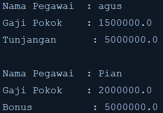
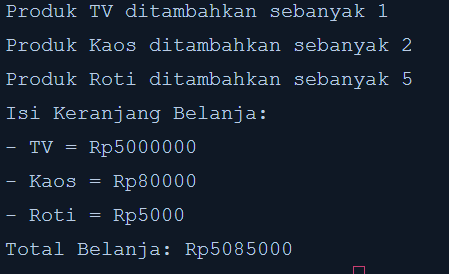

# Pertemuan 7

| Keterangan | Data                |
| ---------- | ------------------- |
| **Nama**   | Eky Fikri Yamansyah |
| **NIM**    | 312310572           |
| **Kelas**  | TI.23.A6            |

## Latihan
Class Pegawai :
```java
package Pegawai;

public class Pegawai {
    private String nama;
    private double gajiPokok;

    public Pegawai (String nama, double gajiPokok) {
        this.nama = nama;
        this.gajiPokok = gajiPokok;
    }

    // Setter dan Getter untuk nama
    public String getNama() {
        return nama;
    }

    public void setNama(String nama) {
        this.nama = nama;
    }

    // Setter dan Getter untuk gajiPokok
    public double getGajiPokok() {
        return gajiPokok;
    }

    public void setGajiPokok(double gajiPokok) {
        this.gajiPokok = gajiPokok;
    }

    // Method untuk mencetak informasi pegawai
    public void cetakInfo() {
        System.out.println("Nama Pegawai  : " + this.nama);
        System.out.println("Gaji Pokok    : " + this.gajiPokok);
    }
}
```
Class Manager :
``` java
package Pegawai;

public class Manager extends Pegawai {
    private double tunjangan;

    public Manager(String nama, double gajiPokok, double tunjangan) {
        super(nama, gajiPokok);
        this.tunjangan = tunjangan;
    }

    // Setter dan Getter untuk tunjangan
    public double getTunjangan() {
        return tunjangan;
    }

    public void setTunjangan(double tunjangan) {
        this.tunjangan = tunjangan;
    }

    // Method untuk mencetak informasi manajer
    @Override
    public void cetakInfo() {
        super.cetakInfo(); // Memanggil metode dari kelas Pegawai
        System.out.println("Tunjangan      : " + this.tunjangan);
    }
}
```
Class Programmer :
``` java
package Pegawai;

public class Programmer extends Pegawai {
    private double bonus;

    public Programmer(String nama,double gajiPokok, double bonus) {
        super(nama, gajiPokok);
        this.bonus = bonus;
    }

    // Setter dan Getter untuk bonus
    public double getBonus() {
        return bonus;
    }

    public void setBonus(double bonus) {
        this.bonus = bonus;
    }

    // Method untuk mencetak informasi programmer
    @Override
    public void cetakInfo() {
        super.cetakInfo();
        System.out.println("Bonus          : " + this.bonus);
    }
}
```
Class Main :
``` java
package Pegawai;

public class Main {
    public static void main(String[] args) {
        // Membuat objek Manager
        Manager manager = new Manager("agus",1500000,5000000);
        manager.cetakInfo();
        System.out.println();

        // Membuat objek Programmer
        Programmer programmer = new Programmer("Pian",2000000,5000000);
        programmer.cetakInfo();
    }
}
```
### output :


## Sistem Pembelian Online dengan Keranjang Belanja
Class Produk :
``` java
package IndoApril;
public class Produk {
    private String namaProduk;
    private int harga;
    private int jumlahStok;

    public Produk(String namaProduk, int harga, int jumlahStok) {
        this.namaProduk = namaProduk;
        this.harga = harga;
        this.jumlahStok = jumlahStok;
    }

    // Getter NamaProduk
    public String getNamaProduk() {
        return namaProduk;
    }

    // Getter Harga
    public int getHarga() {
        return harga;
    }

    // Getter JumlahStok
    public int getJumlahStok() {
        return jumlahStok;
    }


    public void kurangiStok(int jumlah) {
        this.jumlahStok -= jumlah;
    }

    public void displayInfo(){
        System.out.println("Toko Indo April");
        System.out.println("Nama Produk : " + namaProduk);
        System.out.println("Harga Produk : " + harga);
        System.out.println("Jumlah Stok : " + jumlahStok);
    }
}
```
Class elektronik :
``` java
package IndoApril;
public class elektronik extends Produk {
    private int garansi;

    public elektronik (String namaProduk, int harga, int jumlahStok, int garansi) {
        super(namaProduk, harga, jumlahStok);
        this.garansi = garansi;
    }

    // Setter dan Getter Garansi
    public int getGaransi() {
        return garansi;
    }

    public void setGaransi(int garansi) {
        this.garansi = garansi;
    }

    @Override
    public void displayInfo() {
        super.displayInfo();
        System.out.println("Garansi: " + this.garansi + " tahun");

    }
}
```
Class makanan :
``` java
package IndoApril;

import java.util.Date;

public class makanan extends Produk {
    private Date exp;

    public makanan(String namaProduk,int harga,int jumlahStok, Date exp) {
        super(namaProduk, harga, jumlahStok);
        this.exp = exp;
    }

    @Override
    public void displayInfo(){
        super.displayInfo();
        System.out.println("Tanggal Exp: " + this.exp);
    }

}
```
Class pakaian :
``` java
package IndoApril;

public class pakaian extends Produk {
    private String ukuran;
    private String warna;

    public pakaian (String namaProduk, int harga,int jumlahStok, String ukuran, String warna) {
        super(namaProduk, harga, jumlahStok);
        this.ukuran = ukuran;
        this.warna = warna;
    }

    // Getter Ukuran
    public String getUkuran() {
        return ukuran;
    }

    // Getter Warna
    public String getWarna() {
        return warna;
    }

    @Override
    public void displayInfo(){
        super.displayInfo();
        System.out.println("Ukuran : " + this.ukuran);
        System.out.println("Warna : " + this.warna);
    }

}
```
Class Keranjang Belanja :
``` java
package IndoApril;
import java.util.ArrayList;

public class keranjangBelanja {
    private ArrayList<Produk> keranjang;

    public keranjangBelanja() {
        keranjang = new ArrayList<>();
    }

    public void tambahProduk(Produk p, int jumlah) {
        if (p.getJumlahStok() >= jumlah) {
            p.kurangiStok(jumlah);
            keranjang.add(p);
            System.out.println("Produk " + p.getNamaProduk() + " ditambahkan sebanyak " + jumlah);
        } else {
            System.out.println("Stok tidak mencukupi untuk produk " + p.getNamaProduk());
        }
    }

    public int hitungTotalBelanja() {
        int total = 0;
        for (Produk item : keranjang) {
            total += item.getHarga();
        }
        return total;
    }

    public void displayKeranjang() {
        System.out.println("Isi Keranjang Belanja:");
        for (Produk item : keranjang) {
            System.out.println("- " + item.getNamaProduk() + " = Rp" + item.getHarga());
        }
        System.out.println("Total Belanja: Rp" + hitungTotalBelanja());
    }
}
```
Class Main :
```java
package IndoApril;
import java.util.Date;

public class main {
    public static void main(String[] args) {
        // Membuat beberapa produk
        elektronik tv = new elektronik("TV", 5000000, 10, 2);
        pakaian kaos = new pakaian("Kaos", 80000, 15, "L", "Merah");
        makanan roti = new makanan("Roti", 5000, 20, new Date());

        // Membuat keranjang belanja
        keranjangBelanja keranjang = new keranjangBelanja();

        // Menambahkan produk ke keranjang
        keranjang.tambahProduk(tv, 1);
        keranjang.tambahProduk(kaos, 2);
        keranjang.tambahProduk(roti, 5);

        // Menampilkan isi keranjang
        keranjang.displayKeranjang();
    }
}
```
### Output :

